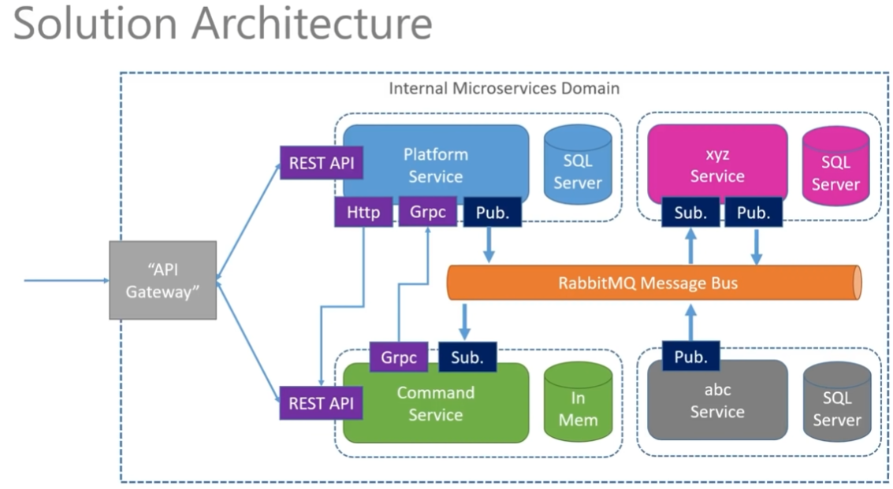
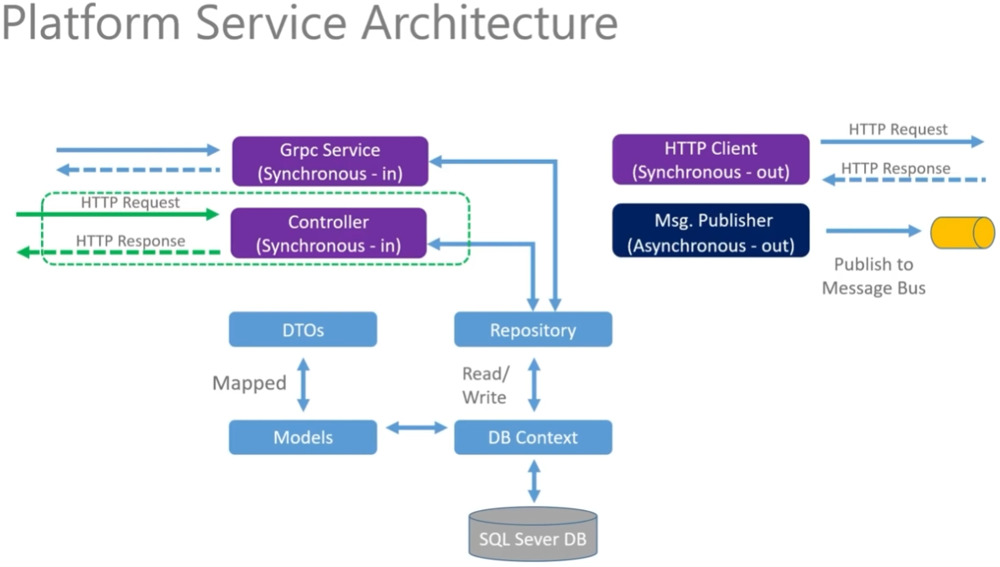
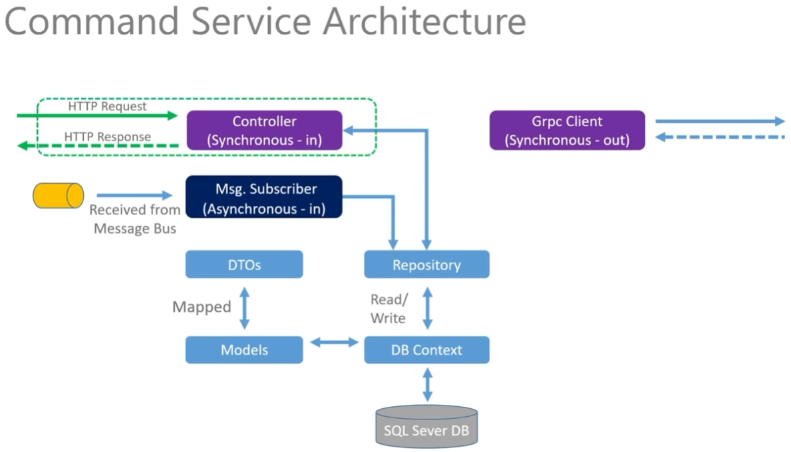
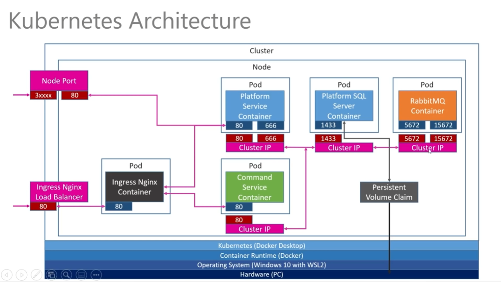

# Microservices
Microservices with c#, docker and kubernetes

This project is based on the .NET Microservices course taught by Les Jackson, which I followed and implemented. The main features of this project include:

Two .NET Microservices. RabbitMQ as a message bus for asynchronous communication between the services. SQL Server as the primary database, with an in-memory database option. All services are hosted in Docker containers. Services are orchestrated using Kubernetes. Nginx is used as the API Gateway.

## Overall architecture


### Platform Service


### Command Service


### Kubernetes


HOWTO:

### Build/Push docker images

```
docker build -t davarski/commandservice:latest .
docker push davarski/commandservice:latest 
docker build -t davarski/platformservice:latest .
docker push davarski/platformservice:latest
```

### Install k3d and create cluster

```
k3d cluster create dotnet  --k3s-arg "--disable=traefik@server:0" \
       --port 9443:443@loadbalancer \
       --port 8080:80@loadbalancer \
       --api-port 6443 \
       --wait
```

### Install Ingress (nginx)

```
kubectl apply -f https://raw.githubusercontent.com/kubernetes/ingress-nginx/master/deploy/static/provider/cloud/deploy.yaml
```

### Apply k8s manifests

```

$ grep -ri pa55w0rd *
K8S/mssql-plat-depl.yaml.BAK:# kubectl create secret generic mssql-secret --from-literal=SA_PASSWORD="pa55w0rd!"
K8S/mssql-plat-depl.yaml:# kubectl create secret generic mssql-secret --from-literal=SA_PASSWORD="pa55w0rd!"
PlatformService/appsettings.Production.json:    "PlatformsConn": "Server=mssql-clusterip-srv,1433;Initial Catalog=platformsdb;User ID=sa;Password=pa55w0rd!;TrustServerCertificate=True"
PlatformService/appsettings.Development.json:    "PlatformsConn": "Server=localhost,1443;Initial Catalog=platformsdb;User ID=sa;Password=pa55w0rd!"

kubectl create secret generic mssql-secret --from-literal=SA_PASSWORD="pa55w0rd!"

kubectl apply -f K8S/

kubectl get ing
NAME          CLASS    HOSTS      ADDRESS       PORTS   AGE
ingress-srv   <none>   acme.com   172.17.15.2   80      38m

grep acme /etc/hosts
172.17.15.2    acme.com

curl acme.com/api/platforms
[{"id":1,"name":"Dot Net","publisher":"Microsoft","cost":"Free"},{"id":2,"name":"SQL Server Express","publisher":"Microsoft","cost":"Free"},{"id":3,"name":"Kubernetes","publisher":"Cloud Native Computing Foundation","cost":"Free"}]

```
